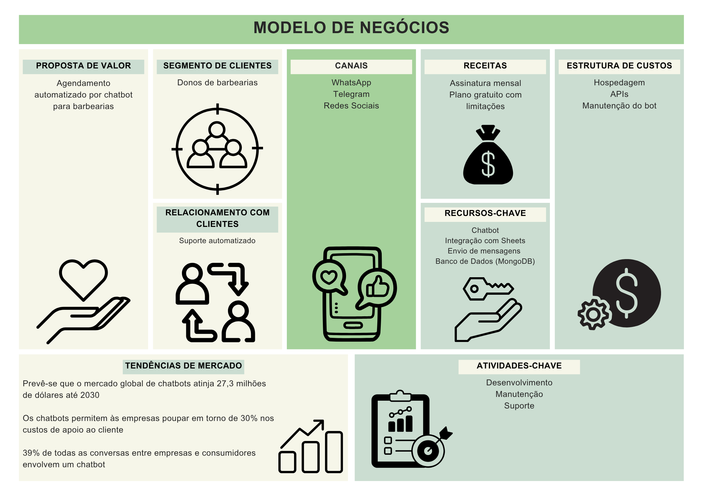

# 💈 **[Cronos] — Projeto Integrador ADS 501**

> **Disciplina:** ADS 501 — Design de Interação e Projeto Integrador  
> **Curso:** Análise e Desenvolvimento de Sistemas  
> **Instituição:** Centro Universitário de Viçosa (Univiçosa) 
>  
> **Orientador(a):** Cristiane Aparecida Lana

> **Co-orientador(a):** Carlos Henrique Tavares Brumatti

---

## ✂️ **Sobre o Projeto**

Este repositório contém o protótipo estático (HTML, CSS, JavaScript) e responsivo do site para barbearias, desenvolvido como parte do projeto integrador da disciplina **ADS 501 — Design de Interação e Projeto Integrador**.

A proposta visa modernizar a presença digital das barbearias, oferecendo uma experiência intuitiva, responsiva e funcional para os clientes, além de facilitar o agendamento de horários e melhorar a organização do ambiente de trabalho.

---

## 🚀 **Tecnologias Utilizadas**

- **HTML5 & CSS3:** estruturação e estilização das páginas  
- **JavaScript:** interatividade do site estático  

---

## 🏢 **Sobre a Cronos**

- **Nome:** Cronos
- **Missão:** Simplificar a gestão de agendamentos para barbearias, automatizando a comunicação com clientes via Telegram e futuramente WhatsApp, além de oferecer um site moderno, responsivo e intuitivo para ampliar a presença digital da barbearia, facilitar o agendamento online e fortalecer o relacionamento com os clientes.
- **Modelo de Negócios:** 

- **Logotipo:** 


---

## 👥 **Equipe**

| Integrante         | Matrícula                   |
|--------------------|-----------------------------|
| Adriel             | 28025                       |
| Alexander          | 28041                       |
| Derick             | 27391                       |
| Hugo               | 27799                       |
| Matheus            | 27177                       |
| Nathan             | 27193                       |

---

## 📂 **Estrutura do Projeto**

```
Cronos-prototipo-estatico
├── /home/              # Páginas HTML
│   ├── agendamento.html
│   ├── barbearia.html
│   ├── conta.html
│   └── home.html
├── /images/            # Imagens do site
├── /static/            # Estilos, fontes e scripts
│   ├── /css/
│   │   ├── agenda.css
│   │   ├── barbearia.css
│   │   ├── conta.css
│   │   └── styleHome.css
│   ├── /fonts/
│   └── /js/
│       ├── cert.js
│       ├── login.js
│       └── signup.js
└── README.md
```

---

## 💻 **Como Rodar o Projeto**

### ✅ Versão Estática

1. Clone o repositório:
   
   git clone https://github.com/Cronos-Project/Cronos-prototipo-estatico.git
   
2. Navegue até a pasta:
   
   cd Cronos-prototipo-estatico/home
   
3. Abra os arquivos \`.html\` no navegador para conferir os componentes estáticos do site

---

## 📌 **Status do Projeto**

- ✅ Protótipo no Figma finalizado
- ✅ Site estático responsivo concluído
- 🔄 Versão dinâmica em desenvolvimento (Next.js)

---

## 📚 **Licença**

Este projeto é acadêmico, desenvolvido para fins educacionais no curso de **Análise e Desenvolvimento de Sistemas**.

---

## 📞 **Contato**

Para mais informações, entre em contato com a equipe pelo e-mail: [estudosprogramacao448@gmail.com]

---

<p align="center">
  Feito com ❤️ pela equipe Libélula.
</p>
